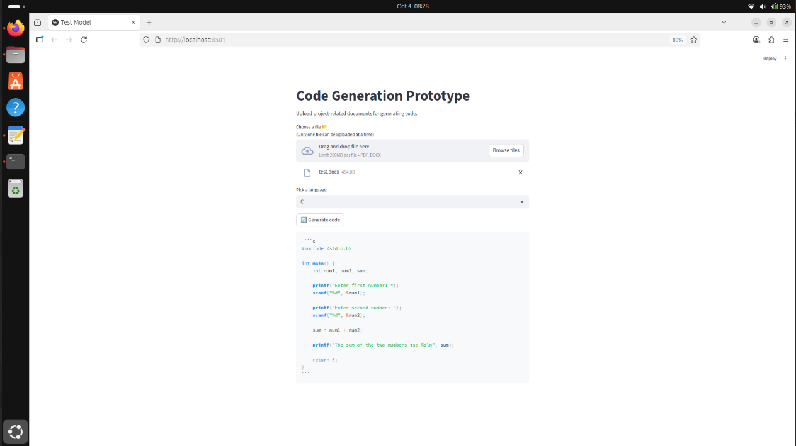
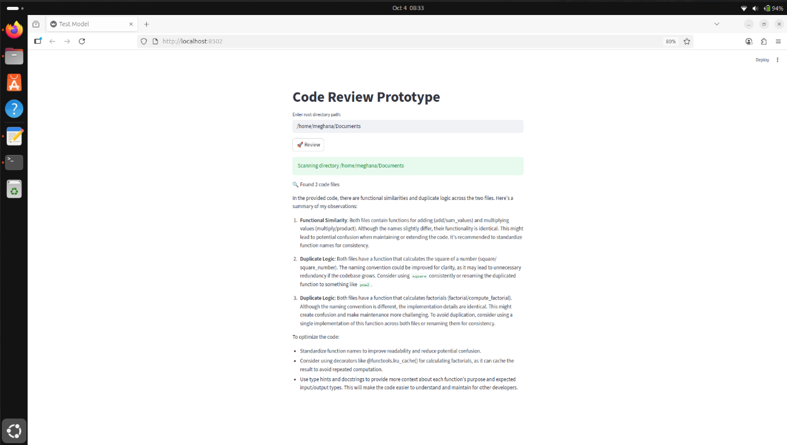

<table>
  <tr>
    <td><h1>Code Generator</h1> Upload a project file and automatically generate corresponding C code using AI.</td>
    <td>
      
    </td>
  </tr>
  <tr>
    <td><h1>Code Review</h1> Provide the root directory of a project, and the tool will detect duplicate or similar functions in the codebase. </td>
    <td>
      
    </td>
  </tr>
</table>
